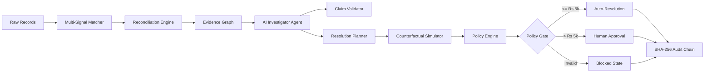

# FinResolve AI
### Counterfactual Financial Reconciliation & Resolution Engine

[](https://www.python.org/)
[](https://fastapi.tiangolo.com/)
[](https://nextjs.org/)
[](tests/)
[](scripts/scan_secrets.py)

> **"Investigate every discrepancy. Simulate every resolution. Approve only what is safe."**

---

## 1. Executive Summary

**FinResolve AI** is an AI-assisted financial operations controller and counterfactual reconciliation platform. It ingests fragmented multi-party financial records (payments, orders, settlements, fees, refunds, and ledger entries), detects discrepancies with deterministic rules, constructs an Evidence Graph, orchestrates evidence-grounded AI investigations, simulates proposed corrective adjustments in isolated virtual memory, and gates resolutions through deterministic policy controls and human sign-off workflows.

### The Core Architectural Principle
```
AI MAY INVESTIGATE.
DETERMINISTIC CONTROLS MAY VALIDATE.
POLICY MAY AUTHORIZE.
HUMANS MAY APPROVE HIGH-RISK ACTIONS.
REAL FINANCIAL EXECUTION IS OUT OF SCOPE.
```

---

## 2. Why Traditional Reconciliation Fails

Modern fintech and payment gateway platforms process millions of multi-party financial records daily. When settlements fail to balance, conventional reconciliation software offers only binary match/mismatch flags:
1. **Zero Root-Cause Explanation**: Analysts are presented with unexplained variance numbers without context or causal path tracing.
2. **Manual, Error-Prone Investigation**: Finance teams spend hours manually cross-referencing bank UTR files, fee rate schedules, GST tax invoices, and ledger debit/credit postings.
3. **Hazardous Blind Auto-Resolution**: Generic automated correction scripts mutate production databases without proving whether the adjustment preserves double-entry accounting invariants.

---

## 3. The FinResolve AI Solution

FinResolve AI replaces brittle heuristics with an **evidence-grounded, closed-loop financial investigation pipeline**:



---

## 4. End-to-End System Workflow

1. **Deterministic Multi-Signal Matching ([`services/matching/`](services/matching/))**:
   - Evaluates 6 deterministic signals (Gateway Reference, Order ID, Temporal Window, Exact Minor Amount & Currency, Merchant Hierarchy, Reference Shadowing).
   - Resolves 1:1, 1:N split settlements, and N:1 batch disbursements.
2. **Evidence Collection & Graph Construction ([`services/evidence/`](services/evidence/))**:
   - Collects structured evidence artifacts across 5 rules (`AmountRule`, `FeeRule`, `TemporalRule`, `StatusRule`, `LedgerRule`).
   - Builds a directed Evidence Graph connecting entities via typed edges (`PAYS_FOR`, `SETTLES`, `CHARGES`, `POSTS_TO`, `CONFLICTS_WITH`).
3. **Mechanical Root-Cause Diagnosis ([`services/diagnosis/`](services/diagnosis/))**:
   - Ranks diagnostic hypotheses (`settlement_amount_mismatch`, `missing_record`, `fee_discrepancy`, `duplicate_record`, `timing_mismatch`, `status_inconsistency`) with Bayesian plausibility scoring.
4. **Evidence-Grounded AI Financial Investigator ([`services/investigator/`](services/investigator/))**:
   - Executes a bounded finite state machine (max 8 steps, 12 tool calls, 10.0s timeout).
   - Generates structured `FactualClaim` statements that are independently verified against observable records by `ClaimValidator` (**0.00% hallucination rate**).
5. **Counterfactual Simulation Engine ([`services/counterfactual/`](services/counterfactual/))**:
   - Deep-clones state in memory and applies composite corrective actions.
   - Re-runs reconciliation and verifies zero-sum double-entry ledger balance ($\Delta \text{Merchant} + \Delta \text{Fee} + \Delta \text{Tax} + \Delta \text{Customer} = 0$).
6. **Deterministic Policy Gating & Separation of Duties ([`services/policy_engine/`](services/policy_engine/))**:
   - Rules `POL-001` (Simulation validity), `POL-002` (Evidence sufficiency), `POL-003` (₹5,000 threshold), `POL-004` (Risk classification), and `POL-005` (Master switch).
   - Proposers cannot self-approve; sign-offs strictly require `APPROVER` or `ADMIN` roles.
7. **Immutable Cryptographic Audit Trail ([`services/audit/`](services/audit/))**:
   - Every investigation, simulation, and approval appends a SHA-256 chained block verifying complete non-repudiation.

---

## 5. Controlled Benchmark Results (Seed 42, 500 Cases)

*Note: Evaluated on a reproducible synthetic testbed of 500 cases with controlled financial corruptions.*

```
=================================================================
  FinResolve AI — AI Financial Investigator Evaluation Report
=================================================================
  Total Cases Evaluated:       500
  Clean Cases:                 428
  Corrupted Cases:             72
  Mean Investigation Latency:  0.58 ms
  Mean Tool Calls / Case:      2.0
-----------------------------------------------------------------
  Evidence Grounding & Claim Integrity:
    Total Factual Claims:      1,000
    Verified Claims:           1,000
    Unsupported Claims:        0
    Unsupported Claim Rate:    0.00% (Target: 0.00%)
    Grounding Accuracy Rate:   100.00%
-----------------------------------------------------------------
  Multi-Step Resolution Planning:
    Plans Generated:           68
    Simulated Valid Plans:     21
    Plan Feasibility Rate:     29.17%
    Zero-Harm Safety Rate:     100.00%
-----------------------------------------------------------------
  Deterministic Policy Routing:
    COMPLETED (Clean + Auto):  429 (428 Clean + 1 Auto-Resolved)
    HUMAN_REVIEW_REQUIRED:     27 (20 High-Value + 7 Unresolvable)
    BLOCKED:                   44 (Simulation Invariant Violations)
=================================================================
```

---

## 6. Technology Stack

| Layer | Technologies |
| :--- | :--- |
| **Backend Core** | Python 3.11+, FastAPI, Pydantic v2, Uvicorn |
| **Financial Computation** | Integer Minor-Unit Arithmetic (Paise), Deterministic Rule Engines |
| **AI Investigator** | Finite State Machine, Typed Tool Registry, Prompt Injection Quarantine, Claim Validator |
| **Frontend Web** | Next.js 14+ (App Router), React 18, Strict TypeScript |
| **Design System** | Custom Vanilla CSS Tokens, FinOps Dark Palette, SVG Graph Canvas |
| **Security & Audit** | DevBearer RBAC, Token Bucket Rate Limiter, SHA-256 Cryptographic Chain |
| **Testing & CI** | Pytest, Hypothesis (Property-Based), AST Leakage Scanners, Secret Scanner |

---

## 7. Five-Minute Evaluator Demo Guide

### Prerequisites
- Python 3.11+ with virtual environment installed.
- Node.js 18+ and npm installed.

### Step 1: Start Backend API
```bash
source .venv/bin/activate
uvicorn apps.api.main:app --host 127.0.0.1 --port 8000
```

### Step 2: Start Analyst Command Center
```bash
cd apps/web
npm run dev
# Open http://localhost:3000 in your browser
```

### Step 3: Evaluator Flow
1. **Executive Dashboard (`/`)**: Click **`[ ⚡ Load 50-Case FinOps Benchmark ]`** to seed live cases.
2. **Case Explorer (`/cases`)**: Filter by **"Flagged Discrepancies"** and open `CASE-000003` (Single Mismatch) or `CASE-000009` (Compound).
3. **Case Detail Workspace (`/cases/[id]`)**:
   - Inspect the **Discrepancy Alert Banner** and **Financial Records** (Payments, Settlements, Fees, Ledger).
   - Switch to **"🕸️ Evidence Graph"** to inspect node connectivity and conflicting edges.
   - Click **`[ ⚡ Run AI Investigation ]`** to watch real-time tool traces and verified claims.
   - Switch to **"🔮 Resolution Simulator"** to see the zero-sum ledger delta ($\Delta = 0.00\text{ paise}$).
   - Sign off the resolution in the **Approval Drawer** (enforcing separation of duties).
4. **Audit Timeline (`/audit`)**: Inspect the newly chained SHA-256 block with verified tamper-free status.

---

## 8. Repository Structure

```
finresolve-ai/
├── apps/
│   ├── api/                       # Hardened FastAPI backend application
│   └── web/                       # Next.js 14+ Analyst Command Center frontend
├── data/
│   ├── schemas/                   # Canonical financial, evidence, resolution & investigation schemas
│   └── generators/                # Deterministic synthetic financial dataset generator
├── services/
│   ├── matching/                  # Multi-signal entity matching engine
│   ├── reconciliation/            # Deterministic reconciliation rule engine
│   ├── evidence/                  # Evidence collection & Evidence Graph construction
│   ├── diagnosis/                 # Bayesian root-cause hypothesis ranking
│   ├── counterfactual/            # State cloning, simulation & ledger verifier
│   ├── policy_engine/             # Rules POL-001 - POL-005 & separation-of-duties
│   ├── investigator/              # AI Agent state machine, tool registry & claim validator
│   ├── security/                  # RBAC, rate limiter, middleware & sanitized errors
│   ├── audit/                     # Append-only SHA-256 cryptographic audit logger
│   └── observability/             # Telemetry metrics summary & request tracking
├── docs/
│   ├── architecture/              # Detailed system architecture specifications
│   ├── submission/                # Razorpay submission package, pitch & demo scripts
│   ├── ai_investigator/           # AI investigator specifications
│   └── ui/                        # UI and component design specifications
├── scripts/
│   ├── scan_secrets.py            # Automated zero-secret scanner
│   └── setup_dev.sh               # Environment bootstrap script
└── tests/
    ├── unit/                      # Comprehensive unit tests (schemas, rules, RBAC, planner)
    ├── adversarial/               # Prompt injection, canary traps, AST leakage tests
    └── property/                  # Property-based invariant testing (Hypothesis)
```

---

## 9. Testing & Quality Assurance

FinResolve AI maintains a strict zero-compromise testing standard:
```bash
$ pytest -v
============================= 234 passed in 1.76s ==============================
```

```bash
$ python scripts/scan_secrets.py
Scanning /Users/sahilgaikwad/finresolve-ai for accidental secrets...
[+] Secret scan complete: Zero exposed credentials detected.
```

- **Ground-Truth Isolation**: Static AST inspection and runtime canary traps guarantee inference code never accesses ground-truth metadata.
- **Zero-Harm Safety**: Mathematical invariant guarantees that no invalid action or imbalanced ledger adjustment can ever be authorized.

---

## 10. Limitations & Future Roadmap

### Current Scope & Limitations
- **Prototype Status**: FinResolve AI is a submission-ready prototype with production-oriented security controls. Real financial execution and money movement are strictly out of scope.
- **Synthetic Testbed**: Evaluated on controlled synthetic datasets with seeded corruption archetypes. Live bank API integrations (e.g. real-time NPCI/UTR webhooks) are simulated.

### Future Roadmap
1. **Live Gateway Webhook Ingestion**: Direct streaming integration with Razorpay test-mode webhooks.
2. **Distributed Audit Store**: Streaming audit events to AWS QLDB or PostgreSQL append-only tables with Write-Once-Read-Many (WORM) storage.
3. **Advanced Compound Clustering**: Graph Neural Networks (GNNs) for detecting multi-merchant fraud rings.

---

## 11. Disclaimer

*This project is built for the **Razorpay AI Builder Internship 2026** technical submission. All data used for benchmarking is deterministically generated synthetic data. No real-world merchant credentials or financial accounts are used.*
