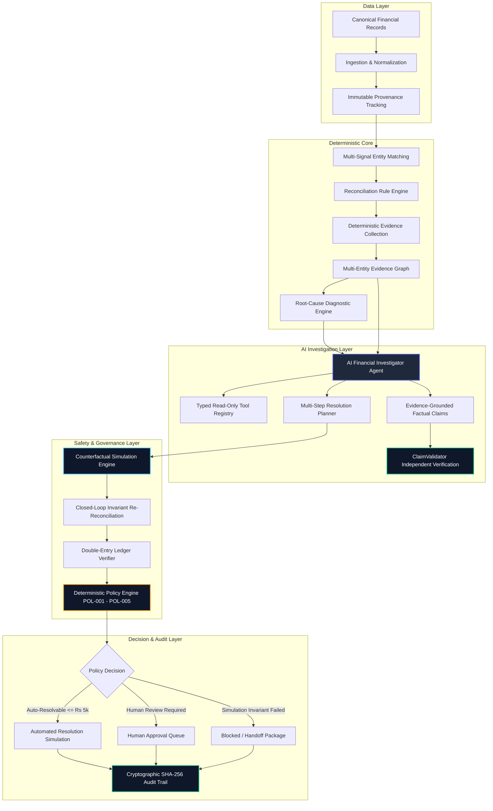

# FinResolve AI — System Architecture & Workflow Specification

## High-Level Architecture

FinResolve AI is designed around a strict unidirectional control hierarchy:
**AI MAY INVESTIGATE. DETERMINISTIC CONTROLS MAY VALIDATE. POLICY MAY AUTHORIZE. HUMANS MAY APPROVE HIGH-RISK ACTIONS. REAL FINANCIAL EXECUTION IS OUT OF SCOPE.**

---

## Architectural Subsystems

### 1. Ingestion & Multi-Signal Matching ([`services/matching/`](file:///Users/sahilgaikwad/finresolve-ai/services/matching/))
- Evaluates 6 deterministic signals (Exact Gateway ID, Order ID, Temporal Window, Amount & Currency, Merchant Hierarchy, Reference Shadowing).
- Supports 1:1, 1:N split settlements, and N:1 batch disbursements without heuristic drift.

### 2. Evidence Graph & Mechanical Diagnosis ([`services/evidence/`](file:///Users/sahilgaikwad/finresolve-ai/services/evidence/))
- Constructs an immutable directed graph connecting Payments, Settlements, Fees, Refunds, and Ledger entries.
- Ranks hypotheses using Bayesian plausibility scoring based strictly on graph edge topology.

### 3. AI Financial Investigator ([`services/investigator/`](file:///Users/sahilgaikwad/finresolve-ai/services/investigator/))
- Orchestrates investigation using a bounded finite state machine (max 8 steps, 12 tool calls, 10.0s timeout).
- Produces `FactualClaim` statements that are independently verified by `ClaimValidator` against observable records and the Evidence Graph.
- Quarantines untrusted transaction strings inside isolated tags to prevent prompt injection.

### 4. Counterfactual Simulation & Ledger Verifier ([`services/counterfactual/`](file:///Users/sahilgaikwad/finresolve-ai/services/counterfactual/))
- Deep-clones the financial state in isolated memory without touching source records.
- Applies candidate corrective actions and runs closed-loop reconciliation.
- Enforces double-entry conservation ($\Delta \text{Merchant} + \Delta \text{Fee} + \Delta \text{Tax} + \Delta \text{Customer} = 0$).

### 5. Policy Engine & Separation of Duties ([`services/policy_engine/`](file:///Users/sahilgaikwad/finresolve-ai/services/policy_engine/))
- Evaluates Rules `POL-001` (Simulation validity), `POL-002` (Evidence sufficiency), `POL-003` (₹5,000 threshold), `POL-004` (Risk classification), and `POL-005` (Master switch).
- Enforces strict separation of duties (proposer cannot approve their own proposal).

### 6. Cryptographic Audit Chain ([`services/audit/`](file:///Users/sahilgaikwad/finresolve-ai/services/audit/))
- Appends immutable SHA-256 chained blocks for every investigation, simulation, and sign-off decision.
